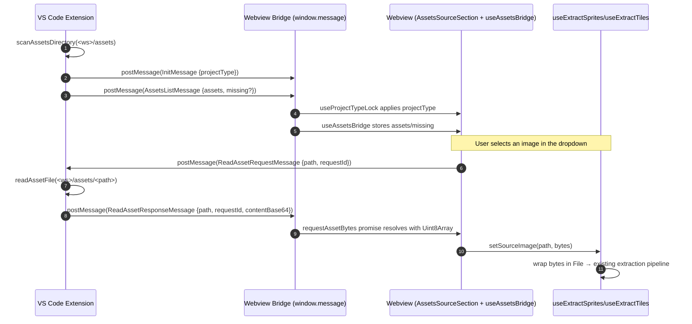

# Design — Assets Source Section

This design replaces the per-page file pickers in `extract-sprites` and `extract-tiles`
with a workspace-directory dropdown (`AssetsSourceSection.vue`). One selection drives
the source image; the `.cfg` is derived from the same folder + basename. State and
output semantics stay exactly as today. `extract-map-tileset` keeps
`SourceSection.vue` and is untouched.

## Review path

1. Skim **Architecture overview** and **Bridge contract** — the contract is the
   single source of truth for everything else.
2. Confirm **File-by-file mapping** matches your mental model of who owns what.
3. The **Tests** section pins the verification surface; everything outside it is
   out of scope for this PR.

Out of scope: `extract-map-tileset`, `.cfg` overwrite confirmation, thumbnails,
manual refresh, save-destination changes, `WriteFilesMessage` shape changes.

---

## 1. Architecture overview

The extension scans `<workspace>/assets/` once on panel open, posts the list, then
serves individual file bytes on demand. The webview renders the list, and only
fetches the bytes of the currently selected image. Tile/sprite state is owned by
the existing composables; switching the image only swaps the source — definitions
persist untouched.



Three independent round-trips, three independent concerns. Lifecycle is "once per
panel open" for the list and "once per selection" for bytes — neither has a
timer, focus listener, or refresh control.

---

## 2. Bridge contract

All additions land in `projects/shared/extract-graphics/extract-graphics-dtos.ts`.
The discriminator union in `projects/shared/infrastructure.ts` is extended to
recognise the three new message types.

### 2.1 New message types and constant

```ts
// projects/shared/extract-graphics/extract-graphics-dtos.ts

/** One image under `<workspace>/assets/`. */
export interface AssetsEntry {
  /** Workspace-relative forward-slash path, e.g. "characters/player.png". */
  path: string;
  /**
   * `true` when `<dirname(path)>/<basename(path)>.cfg` exists on disk at the
   * time of the scan. Cheaply computed during the same walk as the listing.
   */
  configurationExists: boolean;
}

/** Extension → webview. Posted exactly once on panel open for tiles/sprites. */
export interface AssetsListMessage extends VsCodeBridgeMessage {
  messageType: "assetsListFromExtension";
  assets: AssetsEntry[];
  /** True when `<workspace>/assets/` does not exist; `assets` is then empty. */
  missing?: boolean;
}

/** Webview → extension. Asks the host for the bytes of one image. */
export interface ReadAssetRequestMessage extends VsCodeBridgeMessage {
  messageType: "readAssetRequestFromWebview";
  /** Workspace-relative path of an entry from a prior AssetsListMessage. */
  path: string;
  /**
   * Caller-generated opaque id. The matching response carries the same id so
   * concurrent or stale requests can be discarded safely.
   */
  requestId: string;
}

/** Extension → webview. Carries the bytes (base64) or an error string. */
export interface ReadAssetResponseMessage extends VsCodeBridgeMessage {
  messageType: "readAssetResponseFromExtension";
  /** Echoed back from the matching request. */
  path: string;
  requestId: string;
  /** Base64-encoded raw bytes; absent when `error` is set. */
  contentBase64?: string;
  /** Human-readable failure reason; present iff the read failed. */
  error?: string;
}
```

The shared `VsCodeBridgeMessageType` union (in
`projects/shared/infrastructure.ts`) becomes:

```ts
export type VsCodeBridgeMessageType =
  | "init"
  | "writeFiles"
  | "saveMap"
  | "assetsListFromExtension"
  | "readAssetRequestFromWebview"
  | "readAssetResponseFromExtension";
```

### 2.2 Why a separate round-trip for bytes (not eager)

- **Bandwidth**: 500 PNGs/ZXPs at ~50 KB each = ~25 MB worst case. Eager would
  post that on every panel open before the user has even looked at the list.
- **Most selections are one**: users pick one image and stay there. Fetching 499
  extra files is wasted work and slows panel open on slow disks.
- **Independent lifecycles**: the list is fetched once per panel; bytes are
  fetched once per selection. Coupling them forces both to share the same
  refresh policy.
- **Single responsibility**: the list handler stays a pure directory walker;
  the read-asset handler stays a pure file reader. Each is independently testable.

### 2.3 Why `InitMessage` and `AssetsListMessage` stay separate

| Concern | InitMessage | AssetsListMessage |
| --- | --- | --- |
| Consumer | `useProjectTypeLock` (locks code-gen controls) | `useAssetsBridge` (drives the dropdown) |
| Lifecycle | Once on webview boot | Once per panel open (extensible later without breaking init) |
| Payload | `projectType` (declared in `.zxide.json`) | `assets[]` (filesystem scan) |
| Failure mode | Missing is fine (standalone mode) | Missing disables the webview |

Merging them would force `useProjectTypeLock` to know about asset scans, and
would entangle two unrelated boot concerns in one payload. Keep them separate;
each composable listens to its own message type on `window.message`.

## 3. Extension-side implementation

All extension work lives in `projects/vscode-extension/`. The new helper is
testable in isolation; the command stays thin.

### 3.1 New helper: `core/helpers/assets-helpers.ts`

A single `AssetsHelpers` static-method class, modelled on `FileHelpers` and
`WorkspaceHelpers`. The class is **not** in the Inversify container — it is
stateless and has no per-instance dependencies, just like `FileHelpers` and
`WorkspaceHelpers`.

All filesystem access is delegated to `FileHelpers` and all URI building to
`vscode.Uri.joinPath`. The class never calls `vscode.workspace.fs.*`
directly (see `.ai/rules/vscode-extension.md` § Helper-only filesystem and
workspace access).

```ts
// projects/vscode-extension/src/core/helpers/assets-helpers.ts
import * as vscode from "vscode";
import {
  AssetsEntry,
} from "../../../../shared/extract-graphics/extract-graphics-dtos";
import { FileHelpers } from "./file-helpers";

export interface ScanAssetsResult {
  assets: AssetsEntry[];
  missing: boolean;
}

export class AssetsHelpers {
  public static async scanAssetsDirectory(
    workspaceFolderUri: vscode.Uri,
  ): Promise<ScanAssetsResult>;

  public static async readAssetFile(
    workspaceFolderUri: vscode.Uri,
    workspaceRelativePath: string,
  ): Promise<Uint8Array>;
}
```

Implementation notes:

- **Recursive scan** uses `FileHelpers.readDirectory` (which wraps
  `vscode.workspace.fs.readDirectory`) so we stay inside the VS Code virtual
  filesystem (works for remote workspaces, not just local disk). Each
  subdirectory is queued; we sort entries before recursing to keep output
  order deterministic.
- **`configurationExists` is computed inline** during the walk. For each
  image candidate we look up the sibling `.cfg` in the same `readDirectory`
  batch (the directory listing returns `[name, FileType]` tuples, and the
  sibling `.cfg` shows up there when present — no second `stat` needed).
- **Byte reads** go through `FileHelpers.readFileBytes` so the class never
  decodes the file as UTF-8 — important for binary image data.
- **`AssetsHelpers` does not live inside `WorkspaceHelpers`** even though it
  only handles workspace-relative paths: the assets/ contract (cap, inline
  `.cfg` lookup, deep walk) is specific to this feature and would only pollute
  the general-purpose workspace helper.
- **Filtering**: keep only entries whose extension (case-insensitive) is
  `.png` or `.zxp`.
- **Sorting**: lexicographic on the workspace-relative forward-slash path.

### 3.2 Modified: `commands/webview-base.cmd.ts`

Two additions to `execute()` and one new case in `onDidReceiveMessage`:

```ts
// projects/vscode-extension/src/commands/webview-base.cmd.ts (excerpt)

public async execute(..._params: unknown[]): Promise<void> {
  try {
    this.panel = await this.createWebViewPanel();
    this._subscriptions.push(
      this.panel.webview.onDidReceiveMessage(this.onDidReceiveMessage),
    );

    const projectType = await FeaturesService.getProjectType();
    const initMessage: InitMessage = { messageType: 'initFromExtension', projectType };
    this.panel.webview.postMessage(initMessage);

    if (this.requiresAssetsList()) {
      await this.postAssetsList();
    }
  } catch (error) {
    vscode.window.showErrorMessage(
      vscode.l10n.t("Error opening {0}: {1}", this.panelTitle, String(error)),
    );
  }
}

/** Subclasses override to declare whether they consume AssetsListMessage. */
protected requiresAssetsList(): boolean {
  return false;
}

private async postAssetsList(): Promise<void> {
  if (!this.panel) return;
  const workspaceFolder = await WorkspaceHelpers.findZxideWorkspaceFolder();
  const result = await scanAssetsDirectory(workspaceFolder.uri);
  if (result.missing) {
    vscode.window.showErrorMessage(
      "Project requires the assets/ directory at the workspace root",
    );
  }
  this.panel.webview.postMessage({
    messageType: "assetsListFromExtension",
    assets: result.assets,
    missing: result.missing || undefined,
  } satisfies AssetsListMessage);
}

@BindThis
protected async onDidReceiveMessage(
  message:
    | WriteFilesMessage
    | SaveMapMessage
    | ReadAssetRequestMessage
    | undefined,
): Promise<void> {
  if (!this.panel || !message) return;

  if (message.messageType === 'saveMapFromWebview') {
    await this.onSaveMap(message);
    return;
  }

  if (message.messageType === "readAssetRequest") {
    await this.handleReadAssetRequest(message);
    return;
  }

  if (message.messageType !== 'writeFilesFromWebview') return;

  // ... existing writeFiles handling unchanged ...
}

private async handleReadAssetRequest(
  request: ReadAssetRequestMessage,
): Promise<void> {
  if (!this.panel) return;
  try {
    const workspaceFolder = await WorkspaceHelpers.findZxideWorkspaceFolder();
    const bytes = await readAssetFile(workspaceFolder.uri, request.path);
    this.panel.webview.postMessage({
      messageType: "readAssetResponseFromExtension",
      path: request.path,
      requestId: request.requestId,
      contentBase64: Buffer.from(bytes).toString("base64"),
    } satisfies ReadAssetResponseMessage);
  } catch (error) {
    this.panel.webview.postMessage({
      messageType: "readAssetResponseFromExtension",
      path: request.path,
      requestId: request.requestId,
      error: error instanceof Error ? error.message : String(error),
    } satisfies ReadAssetResponseMessage);
  }
}
```

### 3.3 Subclass flips

Each subclass declares whether it consumes the assets list:

| Subclass | `requiresAssetsList()` |
| --- | --- |
| `attach-project-tiles.cmd.ts` | `true` |
| `attach-project-sprites.cmd.ts` | `true` |
| `attach-project-map-tileset.cmd.ts` | `false` (unchanged behaviour) |
| `create-sprites.cmd.ts` | `false` (no source-image flow) |

`attach-project-map-tileset.cmd.ts` does not import or render
`AssetsSourceSection.vue`, so it must not send the message — otherwise the
webview would receive a list it does not render and could mistakenly render
it if someone refactors later. The explicit `false` gate prevents that.

---

## 4. Web-client component design — `AssetsSourceSection.vue`

New file: `projects/web-client/src/shared/components/AssetsSourceSection.vue`.

### 4.1 Props, models, emits

```ts
import type { AssetsEntry } from "externalShared/extract-graphics/extract-graphics-dtos";

const props = defineProps<{
  /** i18n namespace, e.g. "extract-sprites" — used for `assetsSourceSection.*` lookup. */
  translationNamespace: string;
  /** Discovered image list from the extension. Empty array when missing. */
  assets: AssetsEntry[];
  /** When true, the select is disabled and a missing-assets banner is shown. */
  missing: boolean;
}>();

/** Currently selected workspace-relative path, or "" for the placeholder. */
const source = defineModel<string>("source", { required: true });

const emit = defineEmits<{
  /** Fires when the user picks an image. Carries the new path. */
  "image-changed": [path: string];
}>();
```

`image-changed` carries only the path — the App.vue resolves the bytes via
`useAssetsBridge.requestAssetBytes(path)`. This keeps the component dumb and
its surface minimal (props + model + emit), which is what
`SourceSection.vue` already does.

### 4.2 Template structure

```vue
<template>
  <section
    class="w-full border border-[color:var(--border)] bg-[color:var(--card)] p-4"
  >
    <h2 class="text-sm font-semibold text-[color:var(--ink-soft)]">
      {{ tp("assetsSourceSection.sectionSource") }}
    </h2>

    <div class="mt-4 space-y-4">
      <!-- Missing-assets banner (shown only when `missing === true`) -->
      <div
        v-if="missing"
        class="border border-[color:var(--error-ink)] bg-[color:var(--error-bg)] p-3 text-xs text-[color:var(--error-ink)]"
      >
        <p class="font-semibold">{{ tp("assetsSourceSection.missingAssetsTitle") }}</p>
        <p class="mt-1">{{ tp("assetsSourceSection.missingAssetsHint") }}</p>
      </div>

      <!-- Image dropdown -->
      <div>
        <label
          for="assets-source-select"
          class="text-xs font-semibold"
        >
          {{ tp("assetsSourceSection.selectImageLabel") }}
        </label>
        <select
          id="assets-source-select"
          v-model="source"
          class="mt-2 w-full border border-[color:var(--input-border)] bg-[color:var(--input-bg)] px-3 py-2 text-sm font-mono text-[color:var(--input-ink)] disabled:cursor-not-allowed disabled:opacity-60"
          :disabled="missing"
          @change="emit('image-changed', source)"
        >
          <option value="" :disabled="!missing">
            {{ tp("assetsSourceSection.placeholderPrompt") }}
          </option>
          <option
            v-for="entry in assets"
            :key="entry.path"
            :value="entry.path"
          >
            {{ entry.path }}
          </option>
        </select>
        <p class="mt-1 text-xs text-[color:var(--ink-soft)]">
          {{ tp("assetsSourceSection.selectImageHint") }}
        </p>
      </div>

      <!-- Configuration label (read-only) -->
      <div v-if="selectedEntry">
        <label class="text-xs font-semibold">
          {{ tp("assetsSourceSection.configurationLabel") }}
        </label>
        <p class="mt-2 break-all font-mono text-xs text-[color:var(--input-ink)]">
          {{ expectedConfigurationPath }}
          <span
            class="ml-2 text-[color:var(--ink-soft)]"
            :class="selectedEntry.configurationExists
              ? 'text-[color:var(--success-ink)]'
              : 'text-[color:var(--ink-soft)]'"
          >
            ({{ selectedEntry.configurationExists
                ? tp("assetsSourceSection.configurationExists")
                : tp("assetsSourceSection.configurationMissing") }})
          </span>
        </p>
      </div>
    </div>
  </section>
</template>
```

### 4.3 Computed values inside `<script setup>`

```ts
const tp = createTranslationPrefixFn(props.translationNamespace);

const selectedEntry = computed<AssetsEntry | undefined>(() =>
  props.assets.find((entry) => entry.path === source.value),
);

const expectedConfigurationPath = computed<string>(() => {
  const dotIndex = source.value.lastIndexOf(".");
  const stem = dotIndex >= 0 ? source.value.slice(0, dotIndex) : source.value;
  return `${stem}.cfg`;
});
```

### 4.4 Accessibility

| Concern | Resolution |
| --- | --- |
| Label association | Native `<label for="assets-source-select">` wraps the `<select>`. |
| Keyboard nav | Native `<select>` handles arrows, Home/End, type-ahead. No custom handlers. |
| Focus visibility | Tailwind `focus:ring` applied via shared `var(--focus-ring)` token (matches `SourceSection.vue`). |
| Disabled state | `:disabled="missing"` blocks keyboard interaction while the directory is absent. |
| Banner semantics | The missing-assets banner is a static `<div>` (not `role="alert"`) — the VS Code toast already conveys the same error and the banner is informational. |

### 4.5 Styling parity

Uses the exact same CSS custom properties as `SourceSection.vue`:
`--border`, `--card`, `--ink-soft`, `--error-ink`, `--error-bg`,
`--input-border`, `--input-bg`, `--input-ink`, `--button-bg`, `--success-ink`.
No new theme tokens are introduced.

---

## 5. New composable — `useAssetsBridge.ts`

File: `projects/web-client/src/shared/composables/useAssetsBridge.ts`.

Mirrors `useProjectTypeLock.ts` in shape (window-message listener, `onMounted` /
`onBeforeUnmount`).

```ts
import type {
  AssetsEntry,
  AssetsListMessage,
  ReadAssetRequestMessage,
  ReadAssetResponseMessage,
} from "externalShared/extract-graphics/extract-graphics-dtos";
import { onBeforeUnmount, onMounted, ref } from "vue";

export interface AssetsBridge {
  assets: ReturnType<typeof ref<AssetsEntry[]>>;
  missing: ReturnType<typeof ref<boolean>>;
  requestAssetBytes(path: string): Promise<Uint8Array>;
}

export function useAssetsBridge(): AssetsBridge {
  const assets = ref<AssetsEntry[]>([]);
  const missing = ref<boolean>(false);
  const pendingRequests = new Map<
    string,
    { resolve: (bytes: Uint8Array) => void; reject: (error: Error) => void }
  >();

  function onWindowMessage(event: MessageEvent) {
    const data = event.data as
      | AssetsListMessage
      | ReadAssetResponseMessage
      | undefined;
    if (!data || typeof data !== "object") return;

    if (data.messageType === "assetsListFromExtension") {
      assets.value = data.assets;
      missing.value = data.missing === true;
      return;
    }

    if (data.messageType === "readAssetResponse") {
      const response = data as ReadAssetResponseMessage;
      const pending = pendingRequests.get(response.requestId);
      if (!pending) return; // stale or cancelled
      pendingRequests.delete(response.requestId);
      if (response.error) {
        pending.reject(new Error(response.error));
      } else {
        pending.resolve(base64ToBytes(response.contentBase64 ?? ""));
      }
    }
  }

  async function requestAssetBytes(path: string): Promise<Uint8Array> {
    const requestId = crypto.randomUUID();
    return new Promise<Uint8Array>((resolve, reject) => {
      pendingRequests.set(requestId, { resolve, reject });
      const message: ReadAssetRequestMessage = {
        messageType: "readAssetRequestFromWebview",
        path,
        requestId,
      };
      window.postMessage(message, "*");
    });
  }

  onMounted(() => window.addEventListener("message", onWindowMessage));
  onBeforeUnmount(() => window.removeEventListener("message", onWindowMessage));

  return { assets, missing, requestAssetBytes };
}
```

The composable reaches for `base64ToBytes` from `src/helpers/binary-utils.ts`
(already extracted and unit-tested) — no new binary helper is introduced.

### 5.1 Race-condition strategy

- Each request carries a fresh `requestId` (UUID).
- A `pendingRequests` map keys resolvers by id; unmatched responses are dropped.
- Component unmount / page navigation: a future cleanup pass could
  `reject(new Error("cancelled"))` every pending entry on unmount; not in this
  PR's scope because the current `useExtractSprites` / `useExtractTiles`
  composables are page-scoped and never unmount during a selection.

---

## 6. Composable rework — `useExtractSprites.ts` and `useExtractTiles.ts`

### 6.1 New setter signature

Both composables expose a single source setter:

```ts
// Was: setSourceFile(file: File): Promise<void>
// Now: setSourceImage(path: string, bytes: Uint8Array): Promise<void>
const setSourceImage = async (
  path: string,
  bytes: Uint8Array,
): Promise<void> => {
  try {
    const basename = path.split("/").at(-1) ?? path;
    const dotIndex = basename.lastIndexOf(".");
    const isZxp = basename.slice(dotIndex).toLowerCase() === ".zxp";

    if (isZxp) {
      // convertZxpFileToImageFile reads .text() internally; wrapping the bytes
      // in a File with no explicit mime type lets UTF-8 decode work the same
      // way as a real on-disk .zxp.
      const zxpFile = new File([bytes], basename);
      currentImageFile.value = await convertZxpFileToImageFile(zxpFile);
    } else {
      currentImageFile.value = new File([bytes], basename, {
        type: "image/png",
      });
    }

    state.source = basename;
    await extractFromCurrentImage();
  } catch (error) {
    console.error("Source image load failed:", error);
    setStatus("error", tp("errorSourceFileLoad"));
  }
};
```

`extractFromCurrentImage` is the existing extraction call factored out of the
old `setSourceFile` / `extractTiles`. In `useExtractSprites` it runs
`extractSpritesFromFile`; in `useExtractTiles` it runs `extractTiles`.

### 6.2 Why `Uint8Array` (not `File`)

- The webview does not have the bytes as a `File` anymore — they came across
  the bridge as base64. Decoding once into `Uint8Array` keeps the type honest.
- All downstream consumers (`extractTilesFromPng`, `extractTilesFromZxpFile`,
  `extractSpritesFromFile`, `convertZxpFileToImageFile`, `generateTileSheetPng`)
  accept `File` / `Blob`. We wrap the `Uint8Array` in `new File([bytes], name)`
  only at the boundary, then drop the `File` reference.
- The `Uint8Array` parameter is the natural shape for a "bridge payload of
  bytes" — keeping it avoids leaking `File` into the App.vue ↔ component
  contract.

### 6.3 Verifying `convertZxpFileToImageFile` accepts `Uint8Array`

It does **not** — it takes `File` and calls `file.text()` internally. The
design wraps `bytes` in a synthetic `File([bytes], name)` before calling, so
the existing function is reused unchanged. No thin wrapper is added.

### 6.4 Backwards compatibility

The old `setSourceFile(file: File)` is removed in both composables — the
proposal says no, and `SourceSection.vue` (which emits `file-selected` /
`files-selected`) is no longer imported by `extract-sprites/App.vue` or
`extract-tiles/App.vue`. The composable surface loses one method; the
hosting App.vue swaps to `setSourceImage`. `extract-map-tileset` keeps the
old surface because it keeps `SourceSection.vue`.

### 6.5 State preservation

`setSourceImage` does not touch `state.sprites` / `state.tiles` / `spriteFlags` /
`tileWidth` / `tileHeight` / `excludedSet`. Only `state.source` and
`currentImageFile` are mutated. Re-extraction happens (because the new image
needs new bitmaps), but the user's definitions stay intact. This matches the
spec scenarios S4 and S5.

### 6.6 Type cleanup

The existing `ref<File | null>(null)` for `currentImageFile` is replaced with
`ref<File | undefined>(undefined)` in both composables — `null` is forbidden
by `CODE_STYLE.md` §3.5. The `if (!currentImageFile.value)` check still works
because `undefined` is falsy.

---

## 7. File-by-file mapping

| File path | Kind | What changes |
| --- | --- | --- |
| `projects/shared/extract-graphics/extract-graphics-dtos.ts` | modify | Add `AssetsEntry`, `AssetsListMessage`, `ReadAssetRequestMessage`, `ReadAssetResponseMessage`. |
| `projects/shared/infrastructure.ts` | modify | Extend `VsCodeBridgeMessageType` with `"assetsList" \| "readAssetRequestFromWebview" \| "readAssetResponseFromExtension"`. |
| `projects/vscode-extension/src/core/helpers/file-helpers.ts` | modify | Add `readDirectory` and `readFileBytes` so `AssetsHelpers` can compose them instead of touching `vscode.workspace.fs.*`. |
| `projects/vscode-extension/src/core/helpers/assets-helpers.ts` | new | Exports the `AssetsHelpers` static-method class with `scanAssetsDirectory` and `readAssetFile`. |
| `projects/vscode-extension/src/commands/webview-base.cmd.ts` | modify | New `requiresAssetsList` hook; `execute()` posts `AssetsListMessage`; `onDidReceiveMessage` handles `ReadAssetRequestMessage`. Imports `AssetsHelpers` from `@core/helpers/assets-helpers`. |
| `projects/vscode-extension/src/commands/attach-project-tiles.cmd.ts` | modify | Override `requiresAssetsList()` → `true`. |
| `projects/vscode-extension/src/commands/attach-project-sprites.cmd.ts` | modify | Override `requiresAssetsList()` → `true`. |
| `projects/vscode-extension/src/commands/attach-project-map-tileset.cmd.ts` | modify | Override `requiresAssetsList()` → `false` (explicit gate, prevents accidental scan). |
| `projects/vscode-extension/src/test/suite/extract-webview-cmd.test.ts` | new (deferred) | Mocha + `@vscode/test-electron` integration tests for scan + read-asset. Deferred: the existing test harness has pre-existing bugs (ESLint config references `airbnbTypescript` which is not imported, and `runTest.ts` needs a `tsconfig` switch to CommonJS); out of scope for PR 1. |
| `projects/web-client/src/shared/components/AssetsSourceSection.vue` | new | The shared dropdown component. |
| `projects/web-client/src/shared/components/AssetsSourceSection.spec.ts` | new | Vitest + jsdom component tests. |
| `projects/web-client/src/shared/composables/useAssetsBridge.ts` | new | Bridge listener + `requestAssetBytes`. |
| `projects/web-client/src/shared/composables/useAssetsBridge.spec.ts` | new | Vitest + jsdom composable tests. |
| `projects/web-client/src/extract-sprites/App.vue` | modify | Replace `<SourceSection>` with `<AssetsSourceSection>`; wire `useAssetsBridge`; call `setSourceImage(path, bytes)` on `image-changed`. |
| `projects/web-client/src/extract-sprites/composables/useExtractSprites.ts` | modify | Remove `setSourceFile(File)`; add `setSourceImage(path, bytes)`; switch `currentImageFile` to `File \| undefined`. |
| `projects/web-client/src/extract-sprites/composables/useExtractSprites.spec.ts` | new | Vitest: `setSourceImage` triggers extraction and preserves sprites. |
| `projects/web-client/src/extract-tiles/App.vue` | modify | Same swap as `extract-sprites/App.vue`. |
| `projects/web-client/src/extract-tiles/composables/useExtractTiles.ts` | modify | Same setter rework as `useExtractSprites.ts`. |
| `projects/web-client/src/extract-tiles/composables/useExtractTiles.spec.ts` | new | Vitest: `setSourceImage` triggers extraction and preserves tiles. |
| `projects/web-client/src/i18n.ts` | modify | Add `assetsSourceSection` block to both `en` and `es`. |
| `projects/web-client/src/shared/components/SourceSection.vue` | **unchanged** | Still used by `extract-map-tileset`. |
| `projects/web-client/src/extract-map-tileset/App.vue` | **unchanged** | Keeps `SourceSection.vue` + `SaveMapMessage` flow. |
| `projects/web-client/src/shared/composables/useProjectTypeLock.ts` | **unchanged** | Still listens for `InitMessage`. |

---

## 8. i18n surface — `assetsSourceSection.*`

Add to both `en` and `es` blocks in `projects/web-client/src/i18n.ts`. Keys
live under a top-level `assetsSourceSection` namespace; pages prefix their own
namespace at the call site (e.g. `tp("assetsSourceSection.selectImageLabel")`).

| Key | English | Español |
| --- | --- | --- |
| `sectionSource` | `Source data` | `Datos de origen` |
| `selectImageLabel` | `Source image` | `Imagen de origen` |
| `selectImageHint` | `Pick a PNG or ZX-Paintbrush file from your workspace's assets folder.` | `Elige un archivo PNG o ZX-Paintbrush desde la carpeta assets de tu workspace.` |
| `configurationLabel` | `Configuration file` | `Archivo de configuración` |
| `configurationExists` | `Already exists` | `Ya existe` |
| `configurationMissing` | `Not yet created` | `Aún no creado` |
| `placeholderPrompt` | `Select an image…` | `Selecciona una imagen…` |
| `listTruncated` | `List capped at 500 entries. Refine your assets folder.` | `Lista limitada a 500 entradas. Reduce el contenido de tu carpeta assets.` |
| `missingAssetsTitle` | `Assets folder missing` | `Carpeta assets ausente` |
| `missingAssetsHint` | `Create an assets folder at the workspace root and add PNG or .zxp files to it.` | `Crea una carpeta assets en la raíz del workspace y añade archivos PNG o .zxp.` |

---

## 9. Tests

Strict TDD applies to `projects/web-client`. Tests are written before
implementation; the design ships with the spec coverage below.

### 9.1 `AssetsSourceSection.spec.ts` (Vitest + jsdom)

```ts
// @vitest-environment jsdom
```

| Scenario | Assertion |
| --- | --- |
| Populated list renders one `<option>` per entry plus placeholder | `wrapper.findAll("option")` length is `assets.length + 1`; placeholder `value=""` is first; each subsequent option has `value === entry.path` and text equal to that path. |
| Empty list (`assets=[]`, `missing=false`) renders placeholder only | `wrapper.findAll("option")` length is `1`; select is not disabled. |
| Missing-directory state (`missing=true`) | select carries `disabled` attribute; banner paragraph is in the DOM and contains `missingAssetsTitle` + `missingAssetsHint`. |
| Changing selection emits `image-changed` with new path | `wrapper.find("select").setValue("characters/player.png")` → `emitSpy` called with `("characters/player.png")`; `source.value` updates. |
| `selectedEntry` lookup | when `source.value` matches an entry, the configuration label renders `<basename>.cfg`; the existence / not-yet-created indicator matches `configurationExists`. |
| Accessibility | the `<select>` has a paired `<label for="assets-source-select">`. |

### 9.2 `useAssetsBridge.spec.ts` (Vitest + jsdom)

| Scenario | Assertion |
| --- | --- |
| Receives `AssetsListMessage` and exposes assets/missing | after `dispatchMessage({messageType: "assetsListFromExtension", assets: [...], missing: true})`, refs reflect the payload. |
| `requestAssetBytes(path)` posts `readAssetRequest` with a fresh `requestId` | `postMessage` spy called with `{messageType: "readAssetRequestFromWebview", path, requestId}`. |
| Matching `readAssetResponse` resolves the promise | `await requestAssetBytes("x.png")` resolves to the decoded `Uint8Array`. |
| Mismatched `requestId` is ignored | dispatching a `readAssetResponse` whose id has no pending entry does not throw and leaves refs unchanged. |
| `error` field rejects the promise | `expect(request).rejects.toThrow(/file not found/)`. |
| Listener removed on unmount | `removeEventListener("message", fn)` was called; subsequent dispatches are not observed. |

### 9.3 `useExtractSprites.spec.ts` and `useExtractTiles.spec.ts` (Vitest + jsdom)

| Scenario | Assertion |
| --- | --- |
| `setSourceImage("characters/player.png", pngBytes)` populates `currentImageFile` and triggers extraction | `extractSpritesFromFile` (or `extractTilesFromPng`) called once; `state.source === "player.png"`. |
| ZXP input path delegates to `convertZxpFileToImageFile` | `setSourceImage("x.zxp", zxpBytes)` calls `convertZxpFileToImageFile` with a `File` whose name is `x.zxp` and content is the input bytes. |
| Existing sprites/tiles survive an image switch | after two `setSourceImage` calls, the sprites / tiles array is byte-identical to what it was before the second call. |

### 9.4 `extract-webview-cmd.test.ts` (Mocha + `@vscode/test-electron`)

Lives under the existing harness at
`projects/vscode-extension/src/test/suite/extract-webview-cmd.test.ts`. These
are integration tests — they boot a real VS Code extension host, open a
workspace with a fixture `assets/` tree, and exercise the command end-to-end.

| Scenario | Assertion |
| --- | --- |
| Populated assets directory | `AssetsListMessage` posts sorted entries with correct `configurationExists` flags. |
| Missing directory | `vscode.window.showErrorMessage` called with the canonical string; `AssetsListMessage { assets: [], missing: true }` posted. |
| `ReadAssetRequestMessage` round-trip | webview posts a request; extension responds with the correct base64-decoded bytes; `requestId` echoed. |
| Out-of-tree path is rejected | request for `../package.json` returns `error` field; webview-side promise rejects. |
| `extract-map-tileset` panel does NOT receive the list | its `execute()` does not call `postAssetsList()`. |

---

## 10. Rollout and rollback

Rollout is a single atomic commit that adds the component, the DTO messages,
the new composable, the extension helper, and the App.vue swaps. The branch
follows `feat/assets-source-section`.

Rollback surface (per the proposal):

- Revert the single commit. `SourceSection.vue` returns to both App.vue
  consumers; composables revert to `setSourceFile(file: File)`.
- `SourceSection.vue` and `extract-map-tileset` are untouched, so the
  legacy flow keeps working through any rollback window.
- The unused `assetsSourceSection.*` i18n keys can stay or revert in the same commit —
  no other module imports them.

No migrations are needed because `extract-sprites` and `extract-tiles` are
single-session flows; existing tile/sprite definitions are session-scoped and
do not persist across panel close.

---

## 11. Alternatives considered

| Alternative | Why rejected |
| --- | --- |
| **Eagerly send bytes in `AssetsListMessage`** — extension reads every file under `assets/` and ships the bytes alongside each entry. | Bandwidth blows up at the spec cap (500 × ~50 KB ≈ 25 MB per panel open). Most selections use one image; the rest is wasted transfer. The fetch primitive also becomes harder to test (one giant payload instead of two small messages). |
| **Merge `AssetsListMessage` into `InitMessage`** — one boot-time payload with projectType + assets. | Different consumers (`useProjectTypeLock` vs `useAssetsBridge`), different lifecycles (init is always-once, list could one day refresh), different failure modes (init tolerates missing projectType, list tolerates missing directory). Merging couples them and prevents future asymmetric refreshes. |
| **Webview caches the selected image's bytes across re-renders** — once fetched, keep the `Uint8Array` and skip a refetch. | The state-preservation requirement says only definitions persist; bytes can be cheaply refetched (one `readAssetRequest` round-trip). Caching complicates invalidation when the user edits the image on disk and adds memory pressure in long-lived webviews. |
| **Keep `setSourceFile(File)` as an overload on top of `setSourceImage`** | The proposal says remove it; the legacy picker is gone from both consumers, so the overload would be dead weight and a foot-gun for future maintainers. |

---

## Open spec tensions

None. Every requirement in `specs/assets-source-section/spec.md` has a
concrete home in this design:

| Spec requirement | Design home |
| --- | --- |
| R1: `AssetsListMessage` payload, scan | §2.1, §3.1 |
| R2: Missing-directory blocks UI | §3.2 (`postAssetsList`), §4.2 (banner + `:disabled`), §8 (i18n keys) |
| R3: Dropdown shows workspace-relative paths | §4.2 (option text) |
| R4: Configuration label + existence indicator | §4.2, §4.3 (`expectedConfigurationPath` + `selectedEntry`) |
| R5: Existing tile/sprite definitions survive switch | §6.5 (no mutation of definition state) |
| R6: Asset list fetched exactly once | §3.2 (`postAssetsList` runs once in `execute`); §5 (no refresh hook in `useAssetsBridge`) |
| R7: WriteFilesMessage at workspace root | unchanged — composables still drive `WriteFilesMessage` |
| R8: Silent `.cfg` overwrite | unchanged — extension-side `writeFile` path is untouched |
| R9: `extract-map-tileset` out of scope | §3.3 (`requiresAssetsList()` → `false`); §7 (file mapping marked unchanged) |
